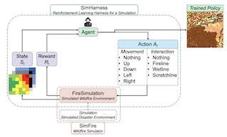

# SimHarness -  Reinforcement Learning for Wildfire Mitigation in Simulated Disaster Environments

SimHarness is a Python-based harness that wraps a [SimFire](https://github.com/mitrefireline/simfire/tree/main)
environment to generate effective wildfire mitigation strategy responses via reinforcement
learning (RL). Through an easy-to-use API, SimHarness can train one, or multiple,
intelligent agents within the SimFire Simulation with a variety of different RL algorithms
defined by [RLlib](https://docs.ray.io/en/latest/rllib/index.html).

Documentation is available [here](https://mitrefireline.github.io/simharness/).

<figure>
    <p align="center">
        <p align="center">
            
            Conceptual workflow for training an RL model using SimHarness within the SimFire environment.
        </p>
</figure>

**Table of Contents**

- [About SimHarness](#about-simharness)
- [Installation](#installation)
- [Getting Started](#getting-started)
- [License](#license)
- [Citation](#citation)

# About SimHarness

SimHarness is a Python repository designed to support the training of
[RLlib](https://docs.ray.io/en/latest/rllib/index.html) RL algorithms within simulated
disaster environments defined by
[SimFire](https://github.com/mitrefireline/simfire/tree/main). SimHarness takes as input
an instance of the
[SimFire Simulation class](https://github.com/mitrefireline/simfire/blob/39abc5a34b103a306c776a3c2972c10a87d0e652/simfire/sim/simulation.py#L37),
such as SimFire's
[FireSimulation](https://github.com/mitrefireline/simfire/blob/39abc5a34b103a306c776a3c2972c10a87d0e652/simfire/sim/simulation.py#L173),
as the training environment.
The [Simulation](https://github.com/mitrefireline/simfire/blob/39abc5a34b103a306c776a3c2972c10a87d0e652/simfire/sim/simulation.py#L37)
object provides an API that allows SimHarness to move agents around the simulated
environment and interact with it by placing mitigations. The
[FireSimulation](https://github.com/mitrefireline/simfire/blob/39abc5a34b103a306c776a3c2972c10a87d0e652/simfire/sim/simulation.py#L173)
agents represent firefighters moving through an environment as a wildfire spreads,
placing mitigations such as firelines to limit the spread of the fire within the area.

The SimHarness training loop functions similarly to a traditional RL training loop, except
it expects the passed-in environment to be a child class of `Simulation` as opposed to a
[gymnasium](https://gymnasium.farama.org) environment. `Simulation`` is currently a class
within the SimFire package, but is expected to be moved to a separate,
non-disaster-specific package in the future. The simulated environment outputs training
signals such as observations and rewards to the SimHarness agent(s) which use the
observations to predict optimal actions. The actions produced by the model provide both
`movement` and `interaction` information. `Movements` are how the agent is traversing
across the environment, such as `[nothing, up, down, left, right]`. `Interactions` are how
the agent is changing the environment itself. In the case of SimFire, this can be
`[nothing, fireline, wetline, scratchline]`. These actions are relayed back to the
simulated environment, which then affects the overall disaster scenario simulated by the
environment.

# Installation

*Note: SimHarness has only been tested on Ubuntu 18.04 and Python 3.9.18

1. **Clone the repository.**

    ```bash
    git clone https://github.com/mitrefireline/simharness.git
    ```

2. **Setup Pyenv Virtual Environment**

    ```bash
    curl https://pyenv.run | bash
    ```

    ```bash
    export PYENV_ROOT="$HOME/.pyenv"
    command -v pyenv >/dev/null || export PATH="$PYENV_ROOT/bin:$PATH"
    eval "$(pyenv init -)"
    ```

    ```bash
    pyenv install 3.9.18
    pyenv local 3.9.18
    ```

3. **Install poetry**

    ```bash
    curl -sSL https://install.python-poetry.org | python3 -
    ```

    *Note: Don't forget to add `poetry` to your path.*
    ```bash
    export PATH="$HOME/.local/bin:$PATH"
    ```

    ```bash
    poetry config virtualenvs.in-project true
    poetry env use 3.9.18
    ```

4. **Install required packages**

    ```bash
    cd simharness
    poetry shell
    poetry install --only main
    ```

    *Note: To re-enter the environment after this step, run `poetry shell`.*


# Getting Started

SimHarness provides a number of tutorials within the `tutorials` section of the
documentation. Documentation is available [here](https://mitrefireline.github.io/simharness/).

# License

SimHarness is released under the [Apache 2.0 license](LICENSE).

# Citation

If you use SimHarness for your work, please cite our white paper with the following BibTex entry.

```BibTeX
@misc{tapley2023simharness,
      title={Reinforcement Learning for Wildfire Mitigation in Simulated Disaster Environments},
      author={Alexander Tapley and Marissa Dotter and Michael Doyle and Aidan Fennelly and Dhanuj Gandikota and Savanna Smith and Michael Threet and Tim Welsh},
      year={2023},
      booktitle={"Proc. of the Tackling Climate Change with Machine Learning Workshop"},
      series={NeurIPS},
      howpublished={\url{https://arxiv.org/abs/2311.15925}}
}
```

This project contains content developed by The MITRE Corporation. If this code is used in
a deployment or embedded within another project, it is requested that you send an email
to opensource@mitre.org in order to let us know where this software is being used.

Copyright ©2022-2023 The MITRE Corporation. ALL RIGHTS RESERVED. Approved for Public Release; Distribution Unlimited. Public Release Case Number 22-3261.
