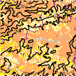
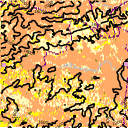

# Examples

SimHarness supports the training of one or multiple agents out-of-the-box. Within this
documentation, we provide information about training both SARL and MARL and show example
outputs from the trained agents as well as performance metrics from the aim dashboard.

## Single-Agent Reinforcement Learning (SARL)

In the single-agent case, there is one agent moving around the simulated environment and
interacting with the simulation to place mitigations. Any DRL algorithm can be applied in
the SARL case, but we have found that DQN is the better algorithm compared to PPO.

To run SARL, the `config.yaml` file is used as the main config for Hydra, which uses the
`default.yaml` config in the `environment` directory for environment creation. The action
space in SARL can be set to either `discrete`, to combine the movements and interactions
into a single action, or `multidiscrete` to keep the movements and interactions separate.

Environment parameters such as `agent_speed`, `initial_agent_pos`, and
`randomize_initial_agent_pos` are all single values that correspond to the individual
agent. During initialization, only one agent is created and information about the single
agent is passed to the Simulation object during training to update agent location and
place the mitigations required by the agent.

Below is a gif of an agent trained in the SARL environment. The agent was trained using
DQN, and utilizes the benchmark sim within the reward function to compare the area
saved with and without mitigations in the reward calculation.

  
  <b>Figure 1.</b> Trained DQN algorithm controlling a single agent for fire mitigation.

## Multi-Agent Reinforcement Learning (MARL)

In the multi-agent case, there are multiple agents moving around the environment at the
same time. Agents are homogenous (at the time of writing), meaning they all have the same
available movements and interactions. While we call this scenario "multi-agent", it is not
truly multi-agent RL but rather a single "brain" that controls multiple agents at once.

To run MARL, the marl_config.yaml file is used as the main config for Hydra, which uses
the `marl.yaml` config in the `environment` directory for environment creation. The action
space for the multi-agent case is a `Tuple` of X `Discrete` action spaces, where X is the
number of agents in the environment. The `reactive_marl.yaml` environment config updates
the agent initial positions, `initial_agent_positions` to a list of `[x, y]` coordinates
to support multiple agents at once. `agent_speed` stays as a single value so each agent
moves at the same speed. `num_agents` is a new parameter to set the number of agents put
in the environment.

Below is a gif of an agent trained in the MARL environment. The agent was trained using
PPO, and utilizes a simple reward function that prioritizes limiting the amount of burning
squares at each time step.

**NOTE:** This action space does not work with DQN, so PPO is the best action space for
the multi-agent scenario for now, though we have not had luck with training agents using
PPO in the multi-agent environment.

  
  <b>Figure 1.</b> PPO algorithm controlling 4 agents for fire mitigation.

